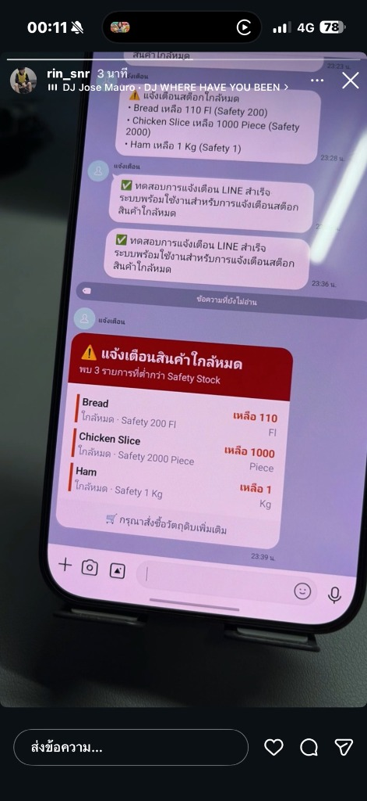

# ระบบติดตามวันหมดอายุและสต็อกสินค้า แจ้งเตือนผ่าน LINE 
**(Stock & Expiration Tracking System with LINE Flex Notification)**

ระบบจัดการสต็อกวัตถุดิบและสินค้า ติดตามวันหมดอายุ และส่งการแจ้งเตือนอัตโนมัติผ่าน **LINE Messaging API (Flex Message)** ดีไซน์การ์ดสีแดงสวยงามตรงตาม Reference พร้อมระบบตัดสต็อกอัตโนมัติแบบ **FIFO** (ตัดล็อตที่ใกล้หมดอายุก่อน) และการวางแผนสต็อกล่วงหน้า



---

## 🌟 คุณสมบัติเด่นของระบบ (Key Features)

1. **การแจ้งเตือนผ่าน LINE (ตรงตามภาพตัวอย่าง):**
   - **การ์ดเตือนสต็อกใกล้หมด (Low Stock Alert):** แสดงรายการสินค้าที่เหลือต่ำกว่า Safety Stock พร้อมจำนวนคงเหลือและหน่วยนับ
   - **การ์ดเตือนวันหมดอายุ (Expiry Alert):** เตือนสินค้าที่จะหมดอายุล่วงหน้าตามวันที่กำหนด (เช่น 7 วัน, 3 วัน หรือหมดอายุแล้ววันนี้)
   - **รองรับทั้ง LINE ส่วนตัวและ LINE กลุ่ม:** ส่งเข้าห้องแชทส่วนตัว หรือดึงบอทเข้ากลุ่มเพื่อแจ้งเตือนทีมงานทุกคนพร้อมกัน
   - **ระบบตั้งเวลาอัตโนมัติ (Automated Cron Job):** สรุปยอดและส่งแจ้งเตือนทุกเช้า (เช่น 08:00 น. สามารถเปลี่ยนเวลาได้)
   - **ปุ่มทดสอบส่งทันที:** มีปุ่มกดทดสอบยิง LINE จากหน้าเว็บเพื่อตรวจสอบความถูกต้องได้ตลอดเวลา

2. **ระบบสต็อกตามล็อตและวันหมดอายุ (Batch & Expiry Tracking):**
   - รองรับ 1 สินค้ามีได้หลายล็อต (แต่ละล็อตมีวันหมดอายุและจำนวนรับเข้าต่างกัน)
   - แสดงสถานะและแถบสีนับถอยหลังวันหมดอายุ (สีเขียว = ปกติ, สีส้ม = ใกล้หมดอายุ, สีแดง = หมดอายุแล้ว)

3. **บันทึกการใช้งาน & วางแผนสต็อก (Usage & Planning):**
   - บันทึกการเบิกใช้ / ชำรุด / ปรับยอด
   - **ระบบตัดสต็อกอัจฉริยะ (FIFO):** แนะนำและตัดสต็อกจากล็อตที่ใกล้หมดอายุก่อนให้อัตโนมัติ เพื่อป้องกันสินค้าเน่าเสีย
   - **คำนวณอัตราการใช้เฉลี่ยต่อวัน (Consumption Rate):** วิเคราะห์ว่าสต็อกคงเหลือจะอยู่ได้อีกประมาณกี่วัน และแนะนำเวลาที่ควรเปิดสั่งซื้อ

4. **ระบบลิงก์ตรงและทางลัดเปิดตรงหน้า (Smart Deep Linking & State Routing):**
   - **แตะจาก LINE:** แตะที่ชื่อสินค้าในข้อความแจ้งเตือน หรือปุ่มใต้การ์ด เพื่อเปิดเว็บและกระโดดไปยังสินค้านั้น หรือเปิดตารางกรองเฉพาะรายการที่ต้องจัดการให้ทันที
   - **คลิกการ์ดบน Dashboard:** คลิกที่การ์ดสถิติ 4 ใบด้านบน หรือปุ่ม "ดูในคลัง ➜" เพื่อสลับไปหน้ารายการสินค้าพร้อมตั้งค่าฟิลเตอร์ให้อัตโนมัติ
   - **รองรับ URL Parameters:** เช่น `?tab=inventory&filter=LOW`, `?tab=inventory&filter=EXPIRING`, `?tab=inventory&product_id=<id>`, `?tab=usage&subtab=inbound`

---

## 🚀 วิธีเริ่มต้นใช้งาน (Getting Started)

### 1. เปิดระบบ
เปิด Terminal ในโฟลเดอร์นี้ แล้วรันคำสั่ง:
```bash
npm start
```
หรือรันแบบ Hot-Reload:
```bash
npm run dev
```

### 2. เข้าใช้งานผ่านเว็บเบราว์เซอร์
เปิดเบราว์เซอร์แล้วไปที่:
👉 **[http://localhost:3000](http://localhost:3000)**

---

## 📲 วิธีตั้งค่า LINE Messaging API ให้ส่งแจ้งเตือน

### ขั้นตอนที่ 1: สร้าง LINE Official Account และ Channel
1. เข้าไปที่เว็บ **[LINE Developers Console](https://developers.line.biz/)** แล้วล็อกอินด้วยบัญชี LINE
2. กดปุ่ม **Create a new provider** (ตั้งชื่ออะไรก็ได้ เช่น `MyStore-Alert`)
3. เลือกสร้าง **Create a Messaging API channel**
4. กรอกข้อมูลร้านค้า/โปรเจกต์ให้เรียบร้อยแล้วกด Create

### ขั้นตอนที่ 2: คัดลอก Channel Access Token
1. เข้าไปที่ Channel ที่เพิ่งสร้าง แล้วคลิกแท็บ **Messaging API**
2. เลื่อนลงไปล่างสุดที่หัวข้อ **Channel access token (long-lived)** แล้วกดปุ่ม **Issue**
3. คัดลอก Token ทั้งหมดมาเก็บไว้

### ขั้นตอนที่ 3: วิธีหา User ID หรือ Group ID สำหรับส่งข้อความ
- **หากต้องการส่งเข้าไลน์ส่วนตัว:**
  - ดูในหน้า LINE Developers > แท็บ **Basic settings** เลื่อนลงมาที่หัวข้อ **Your user ID** (จะขึ้นต้นด้วย `U...`)
- **หากต้องการส่งเข้า LINE กลุ่ม (Group):**
  1. เพิ่มบอท (สแกน QR Code ของบอทในแท็บ Messaging API) แล้วดึงบอทเข้าในกลุ่มไลน์ที่ต้องการ
  2. ในแท็บ Messaging API ให้เปิดฟังก์ชัน **Allow bot to join group chats** เป็น `Enabled`
  3. ตั้งค่า Webhook URL เป็น `https://<YOUR_DOMAIN>/api/line/webhook` (หากรันผ่าน ngrok หรือ Cloud) หรือพิมพ์คำว่า `id` ในกลุ่ม บอทจะตอบกลับ ID ของกลุ่มให้อัตโนมัติ (ขึ้นต้นด้วย `C...` หรือ `R...`)

### ขั้นตอนที่ 4: บันทึกลงในระบบ
1. เปิดหน้าเว็บระบบไปที่แท็บ **⚙️ ตั้งค่า LINE & แจ้งเตือน (LINE Settings)**
2. วาง **Channel Access Token** และ **Target ID**
3. กดปุ่ม **"💾 บันทึกการตั้งค่า"**
4. กดปุ่ม **"🔔 ทดสอบส่งข้อความ"** คุณจะได้รับข้อความ:
   `✅ ทดสอบการแจ้งเตือน LINE สำเร็จ...` เข้ามาใน LINE ทันที!

---

## 📂 โครงสร้างโปรเจกต์ (Project Structure)

```
tracking-expire-date/
├── src/
│   ├── db/
│   │   └── database.js       # ระบบฐานข้อมูล SQLite และ Seed ข้อมูลตัวอย่าง
│   ├── services/
│   │   ├── lineService.js    # สร้าง Flex Message สไตล์การ์ดสีแดง & ยิง LINE Push API
│   │   ├── stockService.js   # บริการคำนวณสต็อก, ล็อตวันหมดอายุ, ตัด FIFO
│   │   └── cronService.js    # ตั้งเวลาส่งแจ้งเตือนอัตโนมัติประจำวัน
│   ├── routes/
│   │   ├── api.js            # REST API (Products, Batches, Usage, Alerts, Settings)
│   │   └── webhook.js        # ตัวรับ Webhook ตรวจจับ Group ID / User ID
│   └── server.js             # Express Server
├── public/
│   ├── index.html            # หน้าจอเว็บ Dashboard สไตล์โมเดิร์น
│   ├── css/style.css         # สไตล์และจำลองการ์ด LINE Flex
│   └── js/app.js             # การทำงาน Reactive Frontend
├── data/
│   └── tracker.db            # ไฟล์ฐานข้อมูล SQLite
├── .env                      # ค่า Config ระบบ
└── package.json
```

